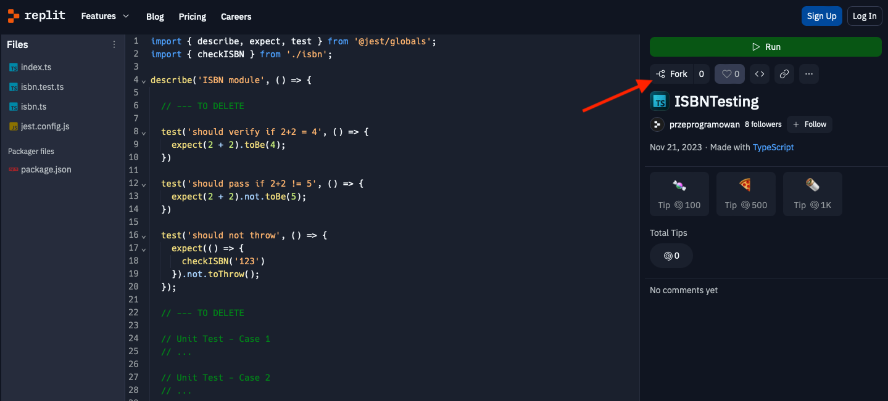

# Testing with AI

## Remote environment



1. Open [replit.com](https://replit.com/@przeprogramowan/ISBNTesting)
2. Click "Fork" to create copy for your personal account
3. If needed, please create free account and continue

## Local environment

```bash
npm install
npm test
npm start
```

Tests are based on [Jest framework - see docs](https://jestjs.io/docs/getting-started)

## Task

The file `index.ts` contains example code submitted for code review. The current implementation is the foundation for an automated code review plugin that can be integrated with the CI/CD pipeline.

### Business logic

Books are identified by ISBN-10 numbers. These numbers usually contain dashes, and for example they look like this: 99921-58-10-7

ISBN-10 consists of 9 digits (from 0 to 9) and one control character (digit or X). The control character X represents the number 10.

The verification algorithm looks like this:

`(x1 * 10 + x2 * 9 + x3 * 8 + x4 * 7 + x5 * 6 + x6 * 5 + x7 * 4 + x8 * 3 + x9 * 2 + x10 * 1) % 11 == 0`

### Examples
ISBN: `85-359-0277-5`
`(8 * 10 + 5 * 9 + 3 * 8 + 5 * 7 + 9 * 6 + 0 * 5 + 2 * 4 + 7 * 3 + 7 * 2 + 5 * 1) % 11 == 0`

This code is a correct ISBN-10 code.

### Your goal
Based on the algorithm presented above, write a checking function passed in the form of an ISBN string.

The function should handle both hyphenated and non-hyphenated ISBNs.